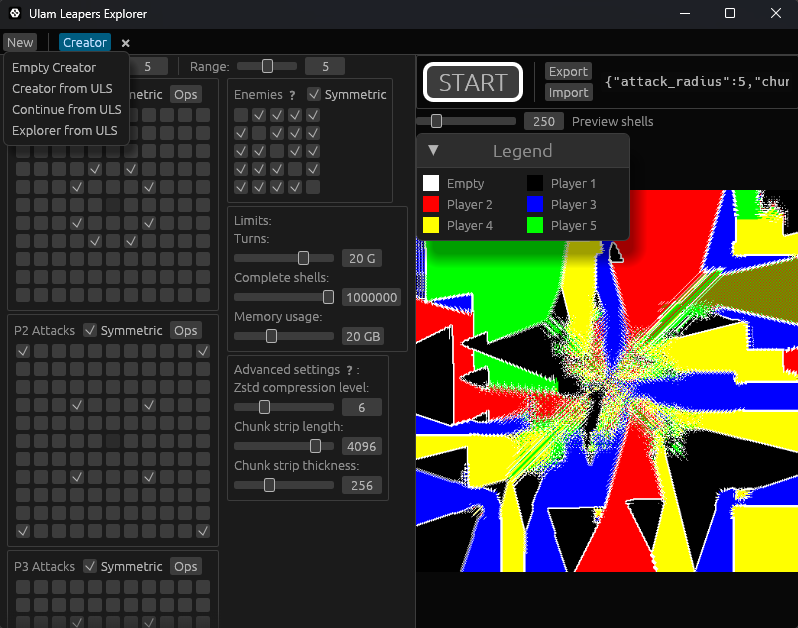
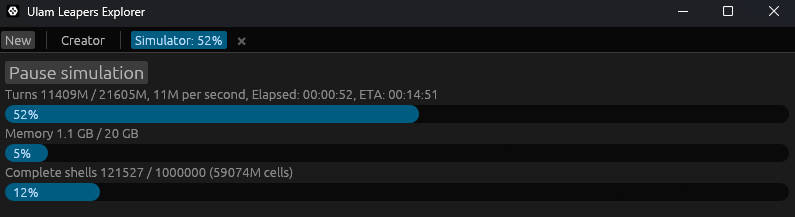
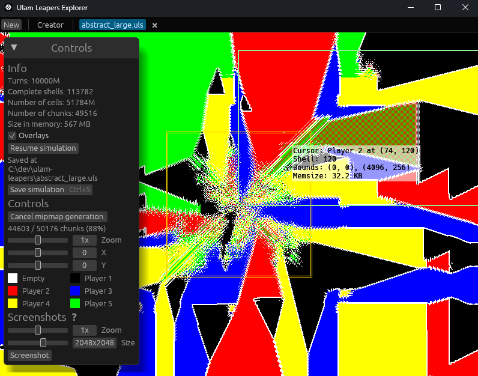

# Ulam Leapers

"Ulam Leapers" is a term coined by this project for a family of
mathematical constructs described by [Jonas Karlsson](https://jonka364.github.io/)
at https://jonka364.github.io/stendhal/stendhal.html. 

This project is interested in simulation of such mathematical constructs - generating
a 2-dimensional grid representation.

The scope of this project:

- a library crate **ulam-leapers** providing necessary infrastructure for creating, running, saving, and loading
simulations of such mathematical constructs, with generous constraints on the 
number of players, pieces, and player relations.
- [a binary crate](#ulam-leapers-explorer) with an [egui](https://github.com/emilk/egui) GUI application
**Ulam Leapers Explorer** allowing easy creation and visualization of simulations
- a specification for a persistent binary format [ULS](./docs/uls) used to store simulations

## Installation

### With Cargo (recommended)

```bash
cargo install ulam-leapers
```

### Prebuilt binaries

If you don’t have Rust installed, you can download a precompiled binary 
for your system from the releases page: https://github.com/Sopel97/ulam-leapers/releases/latest

## Ulam Leapers Explorer

The primary focus of this repository for end-users is the GUI application,
containing most required functionality to explore various configurations.

The interface is very simple, so the demo below should be self-sufficient.

Some small simulation file samples are available [here](./docs/uls/samples)







## Technical details

### Simulation

The grid being generated is divided into chunks in a manner described in greater
detail [here](./docs/uls/README.md#chunking).

During simulation the grid grows outwards from the origin, meaning chunks stop being 
accessed at some point. These chunks get periodically collected and compressed
using [Zstd](https://github.com/facebook/zstd) in memory. This compressed representation
is maintained as much as possible, even during visualization the chunks are
lazily decompressed on demand.

Whether a piece can be placed on a given square is determined not by looking
up grid values, but instead by keeping track of all positions on the spiral
being attacked by a given player. A sliding window structure is used to
deallocate blocks corresponding to positions that are no longer relevant.

Due to the heavily sequential nature of this simulation process it is not
parallelizable, however, chunk compression is performed asynchronously
in worker threads and better compression can be used on higher-end systems.

### Visualization 

The grid is kept compressed in memory at all times. During rendering
necessary chunks are decompressed on demand and sampled. A small cache is
used but even without it the performance is manageable for minification
up to 64x. For higher minification mipmaps can be generated. This is a
costly process because all chunks have to be decompressed and processed.
Parallelism is achieved via rayon, with all available threads being utilized.

## AI policy

ChatGPT and Claude have been used for consultation, debugging, and tests.

There are no restrictions on who can contribute - anyone from plumbers 
to fully automated AI systems is welcome here. 
Note, however, that all contributions are going to be held to the 
same standards and nonsense considered spam.
