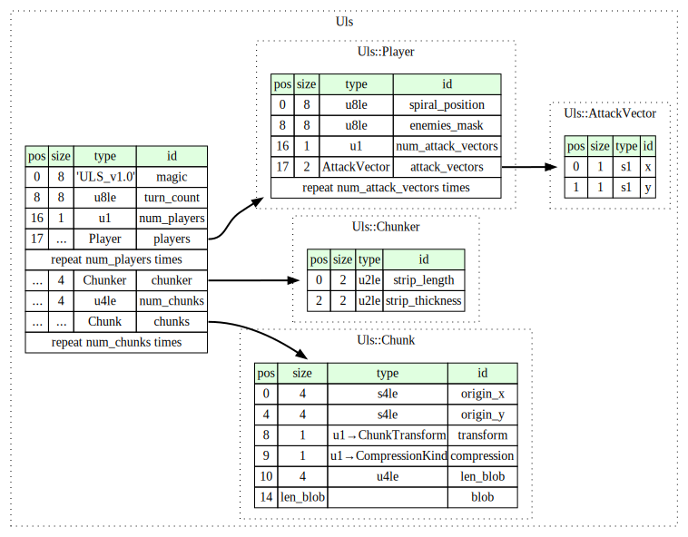

# ULS format specification

## General information

ULS stands for "Ulam Leapers Simulation".

"Ulam Leapers" is a term coined by this specification for a family of 
mathematical constructs described by [Jonas Karlsson](https://jonka364.github.io/)
at https://jonka364.github.io/stendhal/stendhal.html.

This is a binary format with fields being encoded in little-endian byte order.
All fields have sizes that are multiples of a byte.

## Data layout

The layout specified in [Kaitai Struct](https://kaitai.io/) can be found [here](uls.ksy).

Diagram corresponding to the abovementioned specification: 


### Enums

`ChunkTransform`
- `0`: `None`
- `1`: `Transposition`

`CompressionKind`
- `0`: `None`
- `1`: `Zstd`

## Constraints

It is out of scope of this format specification to validate correctness of the encoded simulation results.
Only correctness of individual parts is ensured.

Unless stated otherwise, violating any of the listed constraints renders the data 
ill-formed and compliant parsers MUST reject it. 

If a bound for a field is not specified it is assumed to be bounded by its type only.

Notation `a..=b` is used to represent an inclusive range between `a` and `b`.

Notation `1<<e` is used to represent a number `2` to the power `e`.

In order of parsing:

- `turn_count` must be in range `0..=(1<<60)`
- `num_players` must be in range `0..=63`
- `Player::`
  - `spiral_position` must be in range `0..=(1<<60)`
  - `num_attack_vectors` must be in range `0..=255`
  - all entries of `attack_vectors` must be unique
- `AttackVector::`
  - `x` must be in range `-127..=127`
  - `y` must be in range `-127..=127`
- `Chunker::`
  - `strip_length` must be a power of two in range `64..=8192` 
  - `strip_thickness` must be a power of two in range `64..=8192`
  - `strip_thickness <= strip_length` must be true
- `Chunk::`
  - `origin_x` must be in range `-(1<<30)..=(1<<30)`
  - `origin_y` must be in range `-(1<<30)..=(1<<30)`
  - `(origin_x, origin_y)` must be a valid chunk origin according to the parsed
chunker. [See chunking semantics.](#chunking)
  - `transform` must be either `0` or `1`
  - `compression` must be either `0` or `1`
  - `len_blob` must be in range `0..=(1<<27)`
    - note: `1<<27` is `8192 * 8192 * 2`
- all entries of `chunks` must have a unique origin

### Explicit non-errors

Clarifications regarding less obvious choices made regarding validation.

In order of parsing:

- `Player::enemies_mask` may have bits set for non-existing players, as well as the least 
significant bit which corresponds to player ID `0`, which is reserved for empty cells. 
This is allowed because it does not impact the semantics of the simulation in any way.
- `Chunk::blob` may either be an invalid stream of `compression` kind or decompress to a 
different number of bytes than required by the chunk size. In both cases the stream is
considered ill-formed. However, it is generally not feasible to check the validity of this blob a priori 
without going against the fundamental principles of this format (providing on-demand in-memory decompression).
While parsers are encouraged to perform checks that they deem simple enough not to impact parsing
performance, ultimately applications using this format must handle these possible errors at their 
own layer in a manner they see fit.

## Semantics

### 2-dimensional coordinates

The 2-dimensional coordinates in this format specify points in a discrete Cartesian 
coordinate system, with the x-axis point up and y-axis pointing right.

### Spiral coordinates

The spiral coordinates in this format are 0-based (instead of 1-based) 
[Ulam Spiral](https://en.wikipedia.org/wiki/Ulam_spiral) coordinates.

Spiral coordinate `0` corresponds to the 2-dimensional point `(0, 0)`.

### Players, player IDs, and grid cell values

Players are assigned IDs in ascending order, without holes, starting from `1`.
These IDs correspond to the values in the grid.

Player ID `0` is reserved to mean an empty cell.

### Enemies mask

`Player::enemies_mask` is a bitfield where bit `i` (starting from bit `0`
being the least significant bit and bit `63` being the most significant bit)
determines whether this player prevents the player with ID `i` from being placed
on the grid cells it attacks.

### Chunks

Chunk contains encoded cell values. Each cell value is a 1 byte player ID.
The blob was formed from a 2-dimensional row-major array of cell values, 
first transformed via `Chunk::transform` and then
compressed with `Chunk::compression` kind of compression.
To decode the chunk one must do this process in reverse.

#### Transform

- `ChunkTransform::None` indicates that no transform has been performed

- `ChunkTransform::Transposition` indicates that the 2-dimensional array
  has been transposed, effectively making the order of cells column-major

#### Compression

- `CompressionKind::None` indicates no compression

- `CompressionKind::Zstd` indicates compression in [Zstd](https://github.com/facebook/zstd) frame format

### Chunking

The chunker subdivides the 2-dimensional space into finite sized rectangular regions.

The point with minimum coordinates within a chunk is denoted as its **origin**.

In this particular case the subdivision has two levels. First the grid is
divided into *superchunks*, each being a square with side length of `Chunker::strip_length`,
and its **origin** aligned to `Chunker::strip_length` on both axes.

Subsequently, each *superchunk* is subdivided further into exactly 
`Chunker::strip_length / Chunker::strip_thickness` isomorphic strips,
with orientation determined by the position of its *superchunk*
(with coordinates `(0, 0)` belonging to the position `(0, 0)` *superchunk*).

Given `(sx, sy)` - the position of the *superchunk* - the strip orientation can
be computed in the following way:
```
pub fn orient(sx: i32, sy: i32) -> Orientation {
    let a = sx - sy;
    let b = sx+1 + sy;
    if a * b > 0 {
        Orientation::Vertical
    } else {
        Orientation::Horizontal
    }
}
```

#### Examples

Table showing either `|` for vertical or `-` for horizontal strips
for some superchunk coordinates.
```
 +4  |  |  |  |  |  |  |  |  |  |
 +3  -  |  |  |  |  |  |  |  |  -
 +2  -  -  |  |  |  |  |  |  -  -
 +1  -  -  -  |  |  |  |  -  -  -
 +0  -  -  -  -  |  |  -  -  -  -
 -1  -  -  -  -  |  |  -  -  -  -
 -2  -  -  -  |  |  |  |  -  -  -
 -3  -  -  |  |  |  |  |  |  -  -
 -4  -  |  |  |  |  |  |  |  |  -
 -5  |  |  |  |  |  |  |  |  |  |
    -5 -4 -3 -2 -1 +0 +1 +2 +3 +4
```

Grid subdivision visualization for `strip_length = 2` and `strip_thickness = 1`

Numbers on both axes are the superchunk coordinates
as computed by `div_floor`. `O` signifies the origin.
```
   ┌───┬───┬───┬───┬───┬───┬───┬───┐
 3 ├───┼───┼───┼───┼───┼───┼───┼───┤
   ├─┬─┼───┼───┼───┼───┼───┼───┼─┬─┤
 2 │ │ ├───┼───┼───┼───┼───┼───┤ │ │
   ├─┼─┼─┬─┼───┼───┼───┼───┼─┬─┼─┼─┤
 1 │ │ │ │ ├───┼───┼───┼───┤ │ │ │ │
   ├─┼─┼─┼─┼─┬─┼───┼───┼─┬─┼─┼─┼─┼─┤
 0 │ │ │ │ │ │ ├───┼───┤ │ │ │ │ │ │
   ├─┼─┼─┼─┼─┼─┼───O───┼─┼─┼─┼─┼─┼─┤
-1 │ │ │ │ │ │ ├───┼───┤ │ │ │ │ │ │
   ├─┼─┼─┼─┼─┴─┼───┼───┼─┴─┼─┼─┼─┼─┤
-2 │ │ │ │ ├───┼───┼───┼───┤ │ │ │ │
   ├─┼─┼─┴─┼───┼───┼───┼───┼─┴─┼─┼─┤
-3 │ │ ├───┼───┼───┼───┼───┼───┤ │ │
   ├─┴─┼───┼───┼───┼───┼───┼───┼─┴─┤
-4 ├───┼───┼───┼───┼───┼───┼───┼───┤
   └───┴───┴───┴───┴───┴───┴───┴───┘
    -4  -3  -2  -1   0   1   2   3
```

#### Rationale

This scheme has been chosen to be simple to compute while aligning better
with the Ulam spiral traversal order. In particular, with low `strip_thickness`
it reduces the total size of required active chunks during simulation, significantly
reducing memory footprint for large grids (as active chunks must be kept uncompressed).
While square chunks are possible with this scheme, flatter chunks are encouraged.
The default used in Ulam Leapers Explorer is 4096x256.